# Memory Architecture Documentation

> **Project:** Simplicity Growth Marketing AI Agent System
> **Version:** 1.0
> **Last Updated:** 2025-12-31

---

## Overview

The Simplicity Agent System uses the MCP Knowledge Graph (Memory) to persist and share brand intelligence across agents. This enables agents to access client context without re-reading full documents, ensuring consistency across all deliverables.

**Key Principle:** Memory stores **summaries for quick reference**, not comprehensive data. Full details remain in markdown documents within the client folder structure.

---

## Entity Relationship Diagram

```mermaid
graph TD
    subgraph core [Core Brand Entities]
        Client[Client]
        Brand[Brand]
        Voice[ToneOfVoice]
        Visual[VisualIdentity]
    end
    
    subgraph avatars [Avatar Entities]
        Avatar1[Avatar: Educator]
        Avatar2[Avatar: Expert]
        Avatar3[Avatar: Founder]
    end
    
    subgraph research [Research Entities]
        Comp1[CompetitorInsight: Direct]
        Comp2[CompetitorInsight: Leader]
        Gaps[MarketGap]
    end
    
    subgraph trends [Trend Entities]
        TrendTikTok[TrendSnapshot: TikTok]
        TrendYouTube[TrendSnapshot: YouTube]
        TrendInstagram[TrendSnapshot: Instagram]
        Hooks[HookLibrary]
    end
    
    Brand -->|belongs_to| Client
    Voice -->|defines_voice_for| Brand
    Visual -->|defines_visual_for| Brand
    
    Avatar1 -->|represents| Brand
    Avatar2 -->|represents| Brand
    Avatar3 -->|represents| Brand
    
    Comp1 -->|competes_with| Client
    Comp2 -->|competes_with| Client
    Gaps -->|opportunities_for| Client
    
    TrendTikTok -->|informs_strategy_for| Client
    TrendYouTube -->|informs_strategy_for| Client
    TrendInstagram -->|informs_strategy_for| Client
    Hooks -->|hook_options_for| Client
```



---

## Entity Type Definitions

### Core Brand Entities

#### Client
The root entity for all client-related data.

| Field | Description | Example |
|-------|-------------|---------|
| `business_name` | Full business name | "Taqueria El Sol" |
| `industry` | Industry category | "Restaurant - Mexican" |
| `location` | City, State | "Austin, TX" |
| `status` | Active status | "active" |
| `onboarding_date` | Date onboarded | "2025-01-15" |
| `primary_contact` | Contact name (optional) | "Maria Rodriguez" |

**Naming:** `[client-slug]`  
**Example:** `taqueria-el-sol`

---

#### Brand
Core brand identity and DNA.

| Field | Description | Example |
|-------|-------------|---------|
| `purpose` | Why the brand exists | "To share authentic Oaxacan flavors with the Austin community" |
| `promise` | Brand promise statement | "A taste of home, every visit" |
| `archetype_primary` | Primary archetype | "The Caregiver" |
| `archetype_secondary` | Secondary archetype | "The Creator" |
| `personality_summary` | 2-3 sentence description | "Warm, welcoming, family-oriented..." |
| `tagline` | Primary tagline | "Sabor que recuerda a casa" |
| `core_values` | Comma-separated values | "Family, Authenticity, Community, Quality" |

**Naming:** `[client-slug]-brand`  
**Example:** `taqueria-el-sol-brand`  
**Relation:** `belongs_to` → Client

---

#### ToneOfVoice
Language and communication guidelines.

| Field | Description | Example |
|-------|-------------|---------|
| `language_style` | Language approach | "Bilingual English-Spanish, warm code-switching" |
| `emotional_posture` | Emotional tone | "Warm confidence, familial pride" |
| `formality_level` | Formality description | "Casual but respectful" |
| `signature_phrases` | Common phrases | "Bienvenidos a la familia, Como en casa" |
| `forbidden_words` | Words to avoid | "Cheap, fast food, Tex-Mex" |
| `communication_principles` | Key principles | "Speak like family, educate with pride" |

**Naming:** `[client-slug]-voice`  
**Example:** `taqueria-el-sol-voice`  
**Relation:** `defines_voice_for` → Brand

---

#### VisualIdentity
Visual direction and aesthetic guidelines.

| Field | Description | Example |
|-------|-------------|---------|
| `primary_mood` | Primary visual mood | "Warm Authenticity" |
| `secondary_mood` | Secondary mood | "Cultural Pride" |
| `color_palette_primary` | Primary colors | "#C4540A (terracotta), #2D5016 (forest green)" |
| `color_palette_accent` | Accent colors | "#F4E8D3 (cream), #8B4513 (saddle brown)" |
| `typography_direction` | Font style direction | "Warm serif headers, clean sans-serif body" |
| `lighting_preference` | Lighting style | "Natural, warm, golden hour, 2700-4000K" |
| `photography_style` | Photo approach | "Authentic, real moments, not staged" |
| `video_aesthetic` | Video style | "Intimate, close-up food shots, family moments" |

**Naming:** `[client-slug]-visual`  
**Example:** `taqueria-el-sol-visual`  
**Relation:** `defines_visual_for` → Brand

---

### Avatar Entities

#### Avatar
AI content creator persona representing the brand.

| Field | Description | Example |
|-------|-------------|---------|
| `avatar_name` | Display name | "Chef María" |
| `role` | Role/archetype | "Educator" |
| `purpose` | What this avatar does | "Teaches authentic recipes and techniques" |
| `personality_traits` | Comma-separated traits | "Patient, knowledgeable, passionate, approachable" |
| `voice_style` | How this avatar speaks | "Warm, instructional, encouraging" |
| `visual_appearance` | Physical description | "Latina woman, 45-55, warm smile, chef's apron..." |
| `content_focus` | Content types | "Recipe tutorials, cooking tips, ingredient education" |

**Naming:** `[client-slug]-avatar-[role-slug]`  
**Example:** `taqueria-el-sol-avatar-educator`  
**Relation:** `represents` → Brand

---

### Research Entities

#### CompetitorInsight
Key intelligence about a specific competitor.

| Field | Description | Example |
|-------|-------------|---------|
| `competitor_name` | Full business name | "Chipotle Mexican Grill" |
| `competitor_type` | Category | "indirect" |
| `platforms` | Active platforms | "Instagram, TikTok, YouTube" |
| `content_frequency` | Posts per week | "10-15 posts/week" |
| `primary_format` | Dominant format | "Short-form video, Reels" |
| `positioning` | Positioning summary | "Fast-casual Mexican with customization focus" |
| `key_differentiator` | Main difference | "Speed and convenience over authenticity" |
| `engagement_level` | Relative engagement | "high" |
| `notable_strength` | What they do best | "Consistent brand voice across platforms" |
| `notable_weakness` | Gap observed | "Lacks cultural authenticity storytelling" |
| `research_date` | Date researched | "2025-01-15" |

**Naming:** `[client-slug]-competitor-[competitor-slug]`  
**Example:** `taqueria-el-sol-competitor-chipotle`  
**Relation:** `competes_with` → Client

---

#### MarketGap
Identified opportunities in the competitive landscape.

| Field | Description | Example |
|-------|-------------|---------|
| `gap_1` | First opportunity | "No competitors telling regional Mexican cuisine stories" |
| `gap_2` | Second opportunity | "Family/heritage angle underutilized in market" |
| `gap_3` | Third opportunity | "Educational content about authentic ingredients missing" |
| `saturated_areas` | Overused approaches | "Generic food porn, discount-focused messaging" |
| `underserved_topics` | Ignored topics | "Regional Mexican cuisine education, family recipes" |
| `positioning_opportunity` | Available space | "Authentic Oaxacan specialist vs. generic Mexican" |
| `research_date` | Date researched | "2025-01-15" |

**Naming:** `[client-slug]-market-gaps`  
**Example:** `taqueria-el-sol-market-gaps`  
**Relation:** `opportunities_for` → Client

---

### Trend Entities

#### TrendSnapshot
Platform-specific trend intelligence.

| Field | Description | Example |
|-------|-------------|---------|
| `platform` | Platform name | "tiktok" |
| `research_date` | Date researched | "2025-01-15" |
| `top_formats` | Winning formats | "POV cooking, ASMR food, storytimes" |
| `optimal_length` | Best duration | "30-60 seconds" |
| `hook_patterns` | Dominant hooks | "Direct question, bold claim, visual surprise" |
| `visual_trends` | Visual patterns | "Close-up food shots, fast cuts, text overlays" |
| `audio_trends` | Audio patterns | "Trending sounds, ASMR, voiceover narration" |
| `engagement_signals` | What drives engagement | "Authenticity, cultural pride, recipe requests" |
| `emerging_format` | New format | "Recipe storytimes with family history" |

**Naming:** `[client-slug]-trends-[platform]`  
**Example:** `taqueria-el-sol-trends-tiktok`  
**Relation:** `informs_strategy_for` → Client

---

#### HookLibrary
Collection of high-performing hooks for the client's niche.

| Field | Description | Example |
|-------|-------------|---------|
| `hook_1` | Verbatim hook | "This is the secret ingredient restaurants won't tell you about" |
| `hook_2` | Verbatim hook | "My abuela would kill me for sharing this recipe" |
| `hook_3` | Verbatim hook | "Stop ordering this at Mexican restaurants" |
| `hook_4` | Verbatim hook | "POV: You finally learn to make authentic [dish]" |
| `hook_5` | Verbatim hook | "The difference between Tex-Mex and real Mexican food" |
| `hook_categories` | Categories present | "curiosity, authority, controversy" |
| `source_platforms` | Where found | "TikTok, Instagram Reels" |
| `industry_context` | Applicable industry | "Mexican restaurant, food content" |
| `research_date` | Date researched | "2025-01-15" |

**Naming:** `[client-slug]-hooks`  
**Example:** `taqueria-el-sol-hooks`  
**Relation:** `hook_options_for` → Client

---

## Entity Lifecycle

### Creation Flow

```
1. New Client Onboarding
   └── client-file-architect creates Client entity (if not exists)
   
2. Research Phase
   ├── market-competitor-analyst creates:
   │   ├── CompetitorInsight entities (per competitor)
   │   └── MarketGap entity
   └── trends-platform-analyst creates:
       ├── TrendSnapshot entities (per platform)
       └── HookLibrary entity

3. Brand DNA Phase
   └── brand-dna-architect creates:
       ├── Client entity (if not exists)
       ├── Brand entity
       ├── ToneOfVoice entity
       ├── VisualIdentity entity
       └── Avatar entities (2-4 per client)

4. Ongoing Updates
   ├── Trend data refreshed every 30 days
   ├── Competitor data refreshed quarterly
   └── Brand entities updated on brand refresh
```

### Read Flow

```
Agents that READ memory:

content-strategist
├── Reads: Brand, ToneOfVoice, Avatars
└── Uses for: Content pillar alignment, angle development

creative-director
├── Reads: VisualIdentity, ToneOfVoice, Avatars
└── Uses for: Storyboard direction, script tone

prompt-asset-engineer
├── Reads: VisualIdentity, Avatars, ToneOfVoice
└── Uses for: AI prompt generation, visual consistency

client-file-architect
├── Reads: Client
└── Uses for: Folder naming, documentation context

delivery-documentation-manager
├── Reads: All entities
└── Uses for: Comprehensive delivery documentation
```

---

## Agent Memory Responsibilities

| Agent | Reads | Writes |
|-------|-------|--------|
| `brand-dna-architect` | - | Client, Brand, ToneOfVoice, VisualIdentity, Avatar |
| `market-competitor-analyst` | - | CompetitorInsight, MarketGap |
| `trends-platform-analyst` | - | TrendSnapshot, HookLibrary |
| `content-strategist` | Brand, ToneOfVoice, Avatar | - |
| `creative-director` | VisualIdentity, ToneOfVoice, Avatar | - |
| `prompt-asset-engineer` | VisualIdentity, Avatar, ToneOfVoice | - |
| `client-file-architect` | Client | - |
| `delivery-documentation-manager` | All | - |

---

## Naming Conventions

### Client Slug Generation

Convert business name to slug:
1. Convert to lowercase
2. Replace spaces with hyphens
3. Remove special characters
4. Keep only alphanumeric and hyphens

**Examples:**
- "Taqueria El Sol" → `taqueria-el-sol`
- "María's Kitchen" → `marias-kitchen`
- "Gonzalez & Sons Construction" → `gonzalez-sons-construction`

### Entity Naming Patterns

| Entity Type | Pattern | Example |
|-------------|---------|---------|
| Client | `[client-slug]` | `taqueria-el-sol` |
| Brand | `[client-slug]-brand` | `taqueria-el-sol-brand` |
| ToneOfVoice | `[client-slug]-voice` | `taqueria-el-sol-voice` |
| VisualIdentity | `[client-slug]-visual` | `taqueria-el-sol-visual` |
| Avatar | `[client-slug]-avatar-[role]` | `taqueria-el-sol-avatar-educator` |
| CompetitorInsight | `[client-slug]-competitor-[competitor-slug]` | `taqueria-el-sol-competitor-chipotle` |
| MarketGap | `[client-slug]-market-gaps` | `taqueria-el-sol-market-gaps` |
| TrendSnapshot | `[client-slug]-trends-[platform]` | `taqueria-el-sol-trends-tiktok` |
| HookLibrary | `[client-slug]-hooks` | `taqueria-el-sol-hooks` |

---

## MCP Commands Reference

### Creating Entities

```javascript
mcp__memory__create_entities({
  "entities": [{
    "name": "entity-name",
    "entityType": "EntityType",
    "observations": [
      "field_1: value",
      "field_2: value"
    ]
  }]
})
```

### Creating Relations

```javascript
mcp__memory__create_relations({
  "relations": [{
    "from": "source-entity-name",
    "to": "target-entity-name",
    "relationType": "relation_type"
  }]
})
```

### Querying Entities

```javascript
// Open specific entities by name
mcp__memory__open_nodes(["entity-name-1", "entity-name-2"])

// Search entities by pattern
mcp__memory__search_nodes("search-pattern")
```

### Common Query Patterns

```javascript
// Get all brand context for a client
mcp__memory__open_nodes([
  "[client-slug]-brand",
  "[client-slug]-voice",
  "[client-slug]-visual"
])

// Get all avatars for a client
mcp__memory__search_nodes("[client-slug]-avatar")

// Get all competitor insights
mcp__memory__search_nodes("[client-slug]-competitor")

// Get all trend snapshots
mcp__memory__search_nodes("[client-slug]-trends")

// Get complete client context
mcp__memory__open_nodes(["[client-slug]"])
mcp__memory__search_nodes("[client-slug]-")
```

---

## Best Practices

### For WRITE Agents

1. **Be concise** - Memory stores summaries, not full documents
2. **Include dates** - Always add `research_date` for time-sensitive data
3. **Use consistent naming** - Follow the naming conventions exactly
4. **Create relations** - Always link entities to their parent (Client or Brand)
5. **Verify creation** - Query after creating to confirm success

### For READ Agents

1. **Check for empty results** - Always have a fallback to file-based documents
2. **Verify freshness** - Check `research_date` for trend data (>30 days = stale)
3. **Query efficiently** - Use `open_nodes` for known entities, `search_nodes` for discovery
4. **Flag gaps** - If memory is missing, flag for appropriate agent to populate

### Data Hygiene

1. **Update, don't duplicate** - When refreshing data, update existing entities
2. **Archive old data** - Keep historical research in documents, not memory
3. **Limit competitors** - Store only top 3-5 most relevant competitors
4. **Refresh regularly** - Trend data every 30 days, competitor data quarterly

---

## Troubleshooting

### Memory Returns Empty

1. Check if brand-dna-architect has run for this client
2. Verify entity names match naming convention
3. Check for typos in client-slug
4. Fall back to file-based documents in client folder

### Inconsistent Data

1. Check `research_date` - data may be stale
2. Verify all agents use same client-slug
3. Review source documents for accuracy
4. Flag for brand-dna-architect to re-sync

### Missing Relations

1. Run relation creation commands again
2. Verify both entities exist before creating relation
3. Check relation type spelling matches exactly

---

## Version History

| Version | Date | Changes |
|---------|------|---------|
| 1.0 | 2025-12-31 | Initial memory architecture documentation |

---

*This document is maintained by the SimplicityAgents development team. Update when adding new entity types or modifying memory protocols.*


